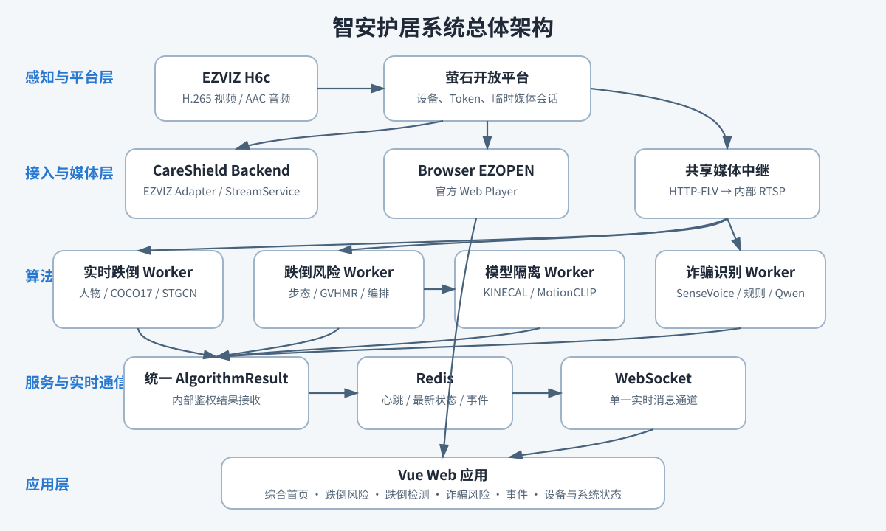
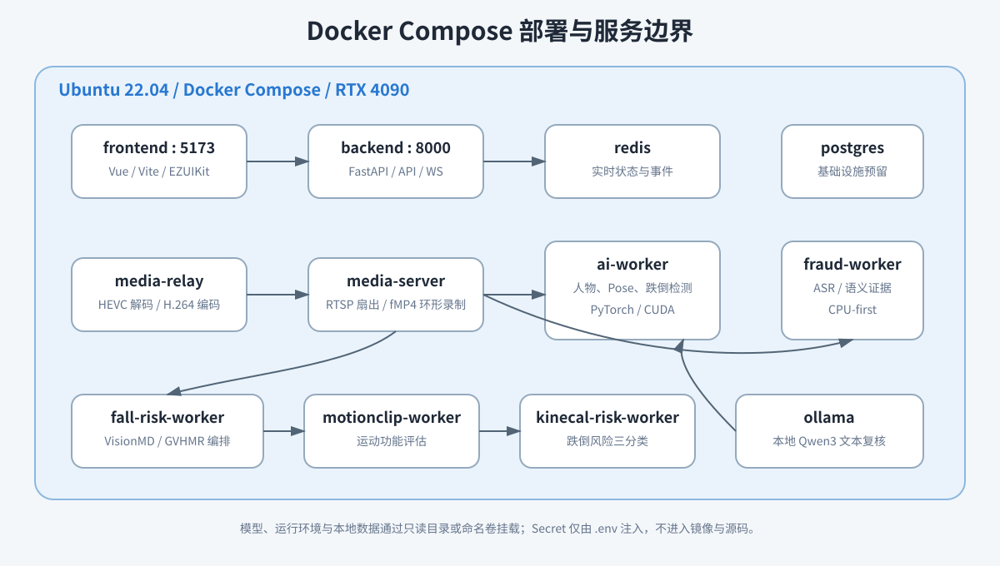
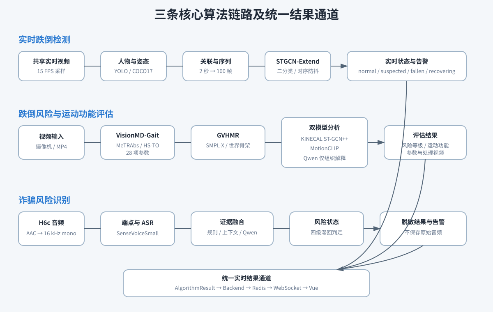

```{=openxml}
<w:p><w:r><w:br w:type="page"/></w:r></w:p>
```

# 目录

1. 系统设计
2. 核心技术开发
3. 部署准备
4. 启动与运行
5. 测试与开发检查
6. 故障排查
7. 当前交付边界
8. 待补充信息汇总

# 文档说明

本文档对应初审材料“04_部署与技术文档”，描述智安护居（CareShield）V1.0 的系统设计、技术实现、部署步骤、运行验证和故障排查。文档基线为 Git 标签 `v1.0.0`、提交 `e8e474c`，目标部署环境为 Ubuntu 22.04、Docker Compose 与 NVIDIA GeForce RTX 4090。部署者按照本文执行每一步后，可通过明确的容器状态、接口响应和页面表现判断操作是否成功。

系统在真实部署中接入萤石 H6c 摄像机。设备凭据、播放会话、模型权重、人体模型资产和家庭视频均不包含在源码包内，必须由具有合法权限的部署者在本机配置。文档不记录 AppSecret、AccessToken、完整设备序列号或完整播放地址。

| 文档项目 | 内容 |
|---|---|
| 系统名称 | 智安护居——多模态居家老人智能风险防控平台 |
| 英文名称 | CareShield |
| 软件版本 | V1.0.0 |
| 代码基线 | `v1.0.0` / `e8e474c` |
| 目标平台 | Ubuntu 22.04 x86_64 |
| 主要设备 | EZVIZ CS-H6c-V200-8H8WFL |
| 文档用途 | 初审部署复现、技术审查和现场验证 |

# 1 系统设计

## 1.1 建设目标与设计边界

智安护居面向居家老人安全监护，把“事前运动功能与跌倒风险评估、事中实时跌倒检测、居家语音诈骗风险提示”组织在同一 Web 平台中。系统既处理连续实时媒体，也处理需要数十秒至数分钟计算的批量运动评估，因此采用模块化 Backend 与独立算法 Worker 的结构。设备接入、媒体处理、算法推理和页面呈现之间以稳定契约连接，模型替换不会要求前端理解 PyTorch、TensorFlow 或具体网络对象，摄像机来源变更也不会直接侵入业务页面。

当前版本已经形成真实设备查询、低延迟浏览器预览、服务端共享媒体、实时跌倒结果、批处理跌倒风险与运动功能分析、实时音频诈骗识别、风险事件展示和运行状态监测。PostgreSQL 容器作为后续正式业务数据基础设施保留，当前业务状态、Worker 心跳、最新算法结果和有界风险事件由 Redis 承担。用户账号、复杂权限、短信和电话联动、PTZ、云录像及医疗器械级临床校准不属于 V1.0 已交付能力。

## 1.2 总体架构

{width=16cm}

图1 智安护居系统总体架构

感知与平台层由 H6c 摄像机和萤石开放平台组成。Backend 通过 EZVIZ Adapter 获取设备状态和临时媒体会话；浏览器使用官方 EZOPEN Web Player 展示实时画面，服务端算法则使用临时 HTTP-FLV，经共享媒体中继规范化为内部 RTSP。两条链路来源相同但面向不同运行环境：浏览器链追求交互和低延迟，算法链需要 Linux 上可持续解码并允许多个 Worker 共享。

算法层按依赖与负载隔离。实时跌倒 Worker 使用 PyTorch、Ultralytics、PyAV 和 CUDA；跌倒风险 Worker 编排 MeTRAbs、Gait Transformer 和 GVHMR；MotionCLIP 与 KINECAL 使用独立运行环境和只读模型挂载；诈骗 Worker 只读取共享音轨，在 CPU 上运行 SenseVoiceSmall，并按需调用本地 Ollama/Qwen3。所有实时业务结果统一转换为 `AlgorithmResult`，由 Backend 完成内部鉴权、Redis 写入和 WebSocket 广播。

## 1.3 完整数据流

设备控制链按“Frontend → Backend API → DeviceService → EZVIZ Adapter → 萤石开放平台”运行。AppKey 与 AppSecret 只存在于 Backend 环境，AccessToken 由 TokenManager 在进程内缓存并依据官方过期时间刷新。浏览器只在显式启用可信播放会话时获得官方播放器所需的运行期 Token，响应禁止缓存，前端不写入 localStorage。

媒体链按用途分流。综合首页通过 EZOPEN 播放真实画面；算法侧由 Backend 请求临时 HTTP-FLV，media-relay 使用 PyAV/FFmpeg 解码 HEVC，等待可用关键帧后以低延迟 H.264 重新编码，AAC 音轨保持转封装，再由 MediaMTX 将同一内部 RTSP 路径扇出给实时跌倒、诈骗识别和跌倒风险采集。该结构避免多个 Worker 分别争用萤石实时会话，并为批处理评估提供 2 秒分片、2 分钟保留的 fMP4 环形记录。

实时算法链把 Worker 结果发送到受 Bearer Token 保护的内部接口。Backend 验证统一 Schema 后更新 Redis latest state，满足告警规则的 `simulated=false` 结果进入有界事件列表，同时通过 `/ws/realtime` 推送到 Vue。批处理跌倒风险链由 Backend 创建评估任务，Worker 从摄像机时间窗或上传 MP4 生成 manifest、参数 JSON、处理视频和模型结果；历史页面根据 manifest 恢复记录，源视频和派生产物不进入 Git。

## 1.4 服务划分

{width=16cm}

图2 Docker Compose 部署与服务边界

| 服务 | 核心职责 | 运行特征 | 对外端口 |
|---|---|---|---|
| frontend | Vue 页面、EZOPEN 播放器、REST 与 WebSocket 客户端 | 无设备 Secret、无模型推理 | 5173 |
| backend | API、设备适配、业务编排、内部鉴权、实时分发 | 不执行视频模型推理 | 8000 |
| media-relay | 单路上游解码、H.264/AAC 规范化 | 不记录完整播放地址 | 仅 Compose 内部 |
| media-server | RTSP 扇出、短时 fMP4 环形录制 | MediaMTX 1.20.0 | 仅 Compose 内部 |
| ai-worker | 人物、姿态、追踪、STGCN-Extend 跌倒检测 | GPU，实时服务 | 仅 Compose 内部 |
| fall-risk-worker | 步态与 GVHMR 管线编排、任务和产物管理 | GPU，单任务批处理 | 仅 Compose 内部 |
| motionclip-worker | 运动序列编码和运动功能评估 | 独立 GPU runtime | 仅 Compose 内部 |
| kinecal-risk-worker | KINECAL ST-GCN++ 跌倒风险三分类 | 独立 GPU runtime | 仅 Compose 内部 |
| fraud-worker | 音频分段、ASR、证据融合和诈骗告警 | CPU-first | 仅 Compose 内部 |
| ollama | 本地 Qwen3 文本复核与解释生成 | GPU | 仅 Compose 内部 |
| redis | Worker TTL、最新结果、状态历史和风险事件 | AOF 持久化 | 仅 Compose 内部 |
| postgres | 后续正式业务数据库基础设施 | 当前未建立业务表 | 仅 Compose 内部 |

# 2 核心技术开发

## 2.1 前端应用与实时交互

前端使用 Vue 3、TypeScript、Vite、Vue Router 和 Element Plus，路由包括综合首页、跌倒风险、跌倒检测、诈骗风险、风险事件、设备管理、算法管理和系统状态。页面只消费 CareShield 标准数据，不解析 EZVIZ 原始响应或模型对象。REST 用于设备、历史和状态快照，单例 `RealtimeClient` 维护 `/ws/realtime` 连接、消息解析、退避重连和组件销毁清理，避免不同页面各自建立实时通道。

综合首页集中显示真实设备数量、实时画面、算法状态、事件趋势和近期事件。跌倒检测页面显示带人物框与 COCO17 骨架的分析画面、当前状态、未校准 Fall Score、人物存在、关键点质量、处理速度及告警确认。跌倒风险页面支持摄像机采集和 MP4 导入，呈现输入视频、原景 SMPL-X 网格、核心步态参数、全部参数、跌倒风险分级、神经退行性疾病相关运动功能评估和历史记录。诈骗风险页面显示当前风险、脱敏语音证据和历史结果。系统在 Worker 不可用、无人或姿态质量不足时明确显示不可用或等待，不以“正常”代替未知状态。

## 2.2 Backend 与接口边界

Backend 使用 FastAPI、Uvicorn、HTTPX 与异步 Redis 客户端。Route 只负责参数、权限、响应和 HTTP 状态码，第三方请求位于 EZVIZ Adapter，业务编排位于 Service。公开接口与内部接口分离：浏览器使用 `/api/*` 与 `/ws/realtime`；Worker 使用 `/internal/ai/*` 和 `/internal/media/*`，并携带 `AI_WORKER_SHARED_TOKEN`。任何公开响应均不返回 AppSecret，媒体诊断接口不返回播放地址。

主要接口如下表。

| 类别 | 方法与路径 | 用途 |
|---|---|---|
| 健康 | `GET /api/health` | Backend 基础健康检查 |
| 系统 | `GET /api/system/status` | Backend、Redis 与 AI Worker 摘要 |
| 设备 | `GET /api/integrations/ezviz/status` | 萤石配置与可达性，不返回凭据 |
| 设备 | `GET /api/devices`、`GET /api/devices/{serial}` | 标准化设备列表与详情 |
| 播放 | `GET /api/devices/{serial}/browser-playback` | 禁止缓存的 EZOPEN 浏览器会话 |
| 媒体 | `GET /api/devices/{serial}/media-info` | 安全音视频元数据 |
| 算法 | `GET /api/algorithms`、`GET /api/algorithms/workers` | Worker、能力与最近结果 |
| 跌倒 | `GET /api/fall-detection/history` | 有界跌倒状态记录 |
| 跌倒 | `POST /api/fall-detection/alert/acknowledge` | 人工确认当前跌倒告警 |
| 风险 | `POST /api/fall-risk/assessments` | 创建摄像机采集任务 |
| 风险 | `POST /api/fall-risk/assessments/upload` | 上传 MP4 创建任务 |
| 风险 | `GET /api/fall-risk/assessments` | 历史评估列表 |
| 诈骗 | `GET /api/fraud-detection/history` | 脱敏诈骗风险历史 |
| 诈骗 | `POST /api/fraud-detection/alert/acknowledge` | 人工确认当前诈骗告警 |
| 事件 | `GET /api/events` | 高风险事件列表 |
| 实时 | `WS /ws/realtime` | 统一实时消息通道 |

## 2.3 共享媒体中继

H6c 标准实时流包含 HEVC/H.265 视频和 AAC 音频。media-relay 只向 Backend 的内部媒体接口申请临时地址，Worker 不接触 EZVIZ Secret。由于设备 HTTP-FLV 中的 HEVC 使用扩展 codec id，系统采用 PyAV 18 自带的新版 FFmpeg 解码，等待干净关键帧后以 `ultrafast`、`zerolatency`、1 秒 GOP、无 B 帧的方式编码为 H.264，音频保持 AAC。MediaMTX 对内部 RTSP 进行多消费者扇出。

批处理采集以任务 `created_at` 为触发时间，额外读取 8 秒隐藏关键帧预卷以补齐 HEVC 参考链，完整解码后裁掉预卷并输出从触发时刻开始的 H.264/yuv420p 视频。该方法解决从 GOP 中间截取 fMP4 导致的绿色色块，同时保证预卷不进入算法时间窗和用户产物。

## 2.4 实时跌倒检测

实时 Worker 以约 15 FPS 读取内部视频。YOLO26s 独立检测 COCO person，YOLO26m-pose 生成 COCO17 关键点，系统按 IoU、包含率和中心距离融合两类结果；人物追踪使用轻量几何关联和短时丢失容忍保持 ID。独立人物框使横卧时关键点不完整仍能表达“人物存在”，但姿态质量不足不会产生“正常”结论。

每个 track 维护 2 秒观测缓存。可靠关键点序列经时间线性重采样形成 75 帧观测，STGCN-Extend 预测后续 25 帧，最终输入张量为 `[N,1,100,17,2]`。二分类 softmax 的 class-1 输出称为 `fall_score`，它未经概率校准。当前分数 0.45–0.65 对应疑似跌倒，达到 0.65 进入 FALLEN；恢复需要连续 5 个低分窗口。状态变化、1 秒心跳或显著分数变化才发布结果，告警至少显示 15 秒，并支持人工确认。

## 2.5 跌倒风险与运动功能评估

跌倒风险链接收 8–60 秒摄像机片段或 MP4。VisionMD-Gait 使用 MeTRAbs 提取 `mpi_inf_3dhp_17` 骨架，选择连续有效人体片段，Gait Transformer 输出 heel strike、toe off 和步态相位，再计算 28 项时空、姿态、变异性与稳定性参数。页面突出步频、步时、步长、步速、步宽、足部清障、躯干倾斜和横向稳定性等 8 项，完整 JSON 仍保留全部可计算结果。空间尺度来自身高与单目三维估计，属于研究量测。

GVHMR 从同一有效视频恢复 SMPL-X 参数与 21 点世界系骨架，产出原景人体网格和世界系动作视图。KINECAL Worker 将世界骨架映射为 H36M-17、归一化并采样为 `[N,3,120,17,1]`，由迁移 ST-GCN++ 产生 NF、FHs、FHm 三分类结果，对应低、中、高研究分级。MotionCLIP Worker 将 SMPL-X 旋转和平移构造为 `[B,25,6,60]` 动作窗口，计算与健康参考向量的余弦距离，并根据 checkpoint 中的概念原型产生 8 项运动概念解释。其正式含义为“基于 MotionCLIP 的神经退行性疾病相关运动功能评估技术”，不构成疾病诊断。

## 2.6 诈骗风险识别

诈骗 Worker 从内部 RTSP 仅解码音轨，统一为 16 kHz 单声道 PCM。能量端点器以 RMS 阈值、尾静音和 0.5–15 秒语句长度切分连续音频；SenseVoiceSmall ONNX 在 CPU 本地完成中文转写和逆文本规范化。检测器在 60 秒、最多 8 段的内存上下文中分析凭据、转账、远控、冒充公检法、投资、保健品、退款中奖、亲属冒充和紧迫话术，并检查“敏感对象+分享动作”等高危组合。

本地 Ollama/Qwen3 可对有效语句做结构化复核，高风险语义作为附加证据，正常判断只削弱部分规则证据，不覆盖已有高危组合。证据经衰减和迟滞形成 normal、suspicious、warning、critical 四级状态。分数表示启发式证据强度，不是诈骗概率。原始家庭音频不落盘，完整对话仅在有界内存中短时存在；发布结果只包含脱敏、限长文本和审计字段。

{width=16cm}

图3 三条核心算法链路与统一结果通道

## 2.7 数据契约、状态与事件

实时模型统一使用 `AlgorithmResult`，核心字段包括结果 ID、任务、模型 ID/版本、设备 ID、源时间、结果时间、标签、0–1 分数、风险等级、延迟、元数据和 `simulated`。测试链必须写入 `simulated=true`，真实 Worker 写入 `simulated=false`；业务首页和事件中心不使用 pipeline test 更新风险状态。

Redis 为 Worker heartbeat 设置 TTL，防止进程退出后长期显示在线；latest result 同样设置过期时间。跌倒和诈骗达到告警条件时，Backend 按告警生命周期保存事件，普通心跳和正常状态不进入事件中心。当前记录属于 Redis 有界业务记录，不等同于长期医疗档案。

## 2.8 安全、隐私与许可证

`.env` 被 Git 忽略，`.env.example` 只包含占位符。AppSecret、Worker Token、数据库密码、AccessToken 和播放地址不得写入源码、日志、README、测试 fixture 或前端持久化。设备序列号在普通页面脱敏；内部媒体接口受 Bearer Token 保护；EZOPEN 会话使用 `Cache-Control: no-store, private`。

家庭视频和语音必须取得授权。滚动媒体只在本地 Docker volume 中短期保留，风险评估产物由操作者管理，原始诈骗音频不保存。GVHMR、SMPL/SMPL-X、MeTRAbs、Ultralytics 和预训练模型分别受研究、非商业或双重许可证约束，比赛展示保留来源与引用，产品化前必须重新完成授权审查。

# 3 部署准备

## 3.1 硬件与软件环境

| 项目 | 要求 | 验证命令 | 成功表现 |
|---|---|---|---|
| 操作系统 | Ubuntu 22.04 x86_64 | `lsb_release -a` | 显示 Ubuntu 22.04 |
| Docker | Docker Engine + Compose v2 | `docker --version`；`docker compose version` | 两条命令均输出版本 |
| GPU | RTX 4090 与可用驱动 | `nvidia-smi` | 显示 NVIDIA GeForce RTX 4090 |
| GPU 容器 | NVIDIA Container Toolkit | 参照 3.5 启动后查看 AI Worker | Worker runtime 为 `cuda:0` |
| 磁盘 | 源码、镜像、模型和运行数据所需空间 | `df -h` | 目标分区保留足够空间 |
| 网络 | 可访问萤石开放平台与首次镜像/依赖源 | 网络连通检查 | 构建和 Token 请求正常 |

无 GPU 电脑可使用 `docker-compose.cpu.yml` 启动平台基础服务。此模式下 GPU 算法应显示 unavailable，不能用 CPU 回退结果冒充本机 GPU 验收。

## 3.2 源码与大文件

解压提交源码后进入项目根目录。若提交包提供了初始化脚本，执行 `bash 02_executables_and_deployment/initialize.sh`；直接使用 Git 仓库时执行：

```bash
git submodule update --init --recursive
```

成功后 `third_party/GVHMR` 中存在固定源码。模型权重、授权人体模型与隔离 runtime 不进入 Git，需要按提交包的《外部资产清单》放置。至少包括 YOLO person/pose、STGCN-Extend、MeTRAbs、GVHMR checkpoint、SMPL/SMPL-X、MotionCLIP checkpoint、KINECAL checkpoint 和 SenseVoiceSmall ONNX。文件缺失时相应 Worker 会显示 not configured 或 unavailable，其他服务仍可启动。

## 3.3 环境配置

复制配置模板并编辑本机文件：

```bash
cp .env.example .env
```

必须替换 PostgreSQL 密码与 `AI_WORKER_SHARED_TOKEN`，填写合法 EZVIZ AppKey/AppSecret，并在可信本地演示环境中显式设置 `EZVIZ_BROWSER_PLAYBACK_ENABLED=true`。不得把平台网页显示的 AccessToken 手工写入 `.env`，Backend 会依据 AppKey/AppSecret 自动申请并刷新 Token。

完成后执行：

```bash
git check-ignore -v .env
```

成功表现为输出 `.gitignore` 中匹配 `.env` 的规则；若没有输出，停止部署并修复忽略规则。

## 3.4 本地模型与运行环境映射

MotionCLIP、KINECAL 和 GVHMR 使用独立本地 runtime，Compose 通过只读挂载使用。`.env` 中的 `MOTIONCLIP_RUNTIME_ROOT`、`MOTIONCLIP_CHECKPOINT_PATH`、`KINECAL_RUNTIME_ROOT`、`KINECAL_CHECKPOINT_PATH` 必须指向当前主机真实路径。SenseVoiceSmall 放置在 `models/fraud/sensevoice-small-onnx/` 或通过 `FRAUD_SENSEVOICE_MODEL_HOST_PATH` 指定。

部署者不得把授权 SMPL/SMPL-X 文件上传公共仓库，也不得把模型下载口令写入提交材料。缺失资产的排查以 Worker health 中的 `missing_requirements` 为准。

# 4 启动与运行

## 4.1 首次构建与启动

在项目根目录执行：

```bash
docker compose up -d --build
```

该命令构建 CareShield 自有镜像并启动 12 个服务。首次构建会下载镜像和依赖，耗时取决于网络、磁盘与模型 runtime。命令返回后执行：

```bash
docker compose ps
```

成功表现：frontend、backend、ai-worker、fall-risk-worker、motionclip-worker、kinecal-risk-worker、fraud-worker、ollama、media-server、media-relay、postgres 和 redis 均为 `Up`；定义健康检查的 backend、各 Worker、ollama、media-relay、postgres、redis 显示 `healthy`。frontend 和 media-server 当前只要求 `Up`。

## 4.2 基础接口验证

按顺序执行下列检查。

| 操作 | 命令 | 成功后应看到 |
|---|---|---|
| Backend 健康 | `curl -f http://localhost:8000/api/health` | `{"status":"ok","service":"backend"}` |
| 前端代理 | `curl -f http://localhost:5173/api/health` | 与 Backend 相同的 JSON |
| 萤石状态 | `curl -f http://localhost:8000/api/integrations/ezviz/status` | `configured` 与 `reachable` 为 true |
| 设备列表 | `curl -f http://localhost:8000/api/devices` | 至少一台标准化设备；不显示 Secret |
| 系统状态 | `curl -f http://localhost:8000/api/system/status` | Backend online、Redis healthy、AI Worker online |
| 算法状态 | `curl -f http://localhost:8000/api/algorithms` | 跌倒检测和诈骗 running、跌倒风险 installed |

不得把包含运行期播放会话的响应复制到日志或提交材料。

## 4.3 Web 页面验证

浏览器访问 `http://localhost:5173`，系统应进入综合首页。验证顺序如下。

1. `/dashboard`：显示 H6c 在线、EZOPEN 画面、算法状态、风险趋势和近期事件。移动摄像机前物体，确认画面内容变化；仅出现播放器首帧不等于真实性验证。
2. `/devices`：显示 EZVIZ 平台、脱敏设备标识、型号与 Online。
3. `/fall-detection`：显示人物框和骨架；无人时显示无人，不自动显示正常；连续可靠骨架达到窗口要求后显示模型结果。
4. `/fall-risk`：填写受试者信息，选择摄像机采集或上传 MP4，观察进度，并在完成后查看输入视频、人体网格、参数、双模型结果和历史记录。
5. `/fraud-risk`：显示 Worker Online、Audio connected、SenseVoice ready；播放授权测试语句后显示脱敏文本与风险状态。
6. `/events`：只展示达到事件规则的真实结果；pipeline test 不进入风险事件。
7. `/algorithms` 与 `/system`：显示 Worker、Redis、Backend 和实时通道状态。

打开浏览器开发者工具 Console。成功表现为无持续脚本异常、无未处理 Promise 错误；自动播放声音被浏览器阻止时，通过官方播放器音量控件手动开启，不视为后端故障。

## 4.4 业务操作

跌倒风险摄像机采集适用于固定机位的连续直线行走，需保证全身和双脚可见。提交后先进入录制，再依次执行媒体校验、步态分析、GVHMR、KINECAL、MotionCLIP 与解释生成；历史记录保留受试者信息、源视频和派生产物。上传模式只接受 MP4，最大 512 MB。

实时跌倒检测无需手工启动。人物进入画面后，系统积累约 2 秒可靠骨架；检测到 FALLEN 后红色提示与人工确认控件至少保持 15 秒。人工确认关闭当前告警展示，但不会篡改模型输出。

诈骗识别持续监听共享音频。授权测试语音必须有清晰可辨的句尾静音以便端点切分。warning 或 critical 激活告警，人工确认使当前生命周期静默；风险回到 normal 后重新布防。摄像机云广播接口已经预留，默认关闭，未购买并验证服务包时不得声称已经完成设备语音联动。

## 4.5 停止与重新启动

正常停止：

```bash
docker compose down
```

该命令停止并移除容器，命名卷仍保留。不要在常规停止中使用 `docker compose down -v`，否则 PostgreSQL、Redis、风险评估产物、短时媒体和 Ollama 模型卷会被删除。

配置修改后重新创建相关服务：

```bash
docker compose up -d --build backend frontend
```

模型或 Worker 配置修改后，把服务名替换为对应 Worker。成功标准仍为 `docker compose ps` 中目标服务 Up/healthy。

# 5 测试与开发检查

## 5.1 单元测试

通用 Python 环境安装开发依赖后执行：

```bash
PYTHONPATH=shared/python python -m pytest backend/tests
PYTHONPATH=shared/python:fall-risk-worker python -m pytest fall-risk-worker/tests
PYTHONPATH=shared/python:fraud-worker python -m pytest fraud-worker/tests
PYTHONPATH=shared/python:media-relay python -m pytest media-relay/tests
PYTHONPATH=kinecal-risk-worker python -m pytest kinecal-risk-worker/tests
```

实时 AI Worker 与 MotionCLIP 必须在包含其固定 PyTorch/CUDA 依赖的隔离测试环境中执行，不应在通用 Backend 虚拟环境中补装另一套深度学习依赖。前端执行：

```bash
cd frontend
npm test
npm run build
```

成功表现为测试无失败、`vue-tsc` 类型检查通过、Vite 生成 `dist/`。构建中的第三方 PURE 注释与大 chunk 提示属于非阻断 warning，应记录但不得隐藏。

## 5.2 代码质量与安全检查

```bash
git diff --check
git status --short
git check-ignore -v .env
```

`git diff --check` 无输出表示未发现空白错误；`git status` 用于确认交付范围；`.env` 必须显示被忽略。Secret 搜索应在不打印真实值的前提下执行，重点检查 `.env.example`、Compose、README、测试 fixture 和日志。

# 6 故障排查

| 现象 | 检查顺序 | 处理方式 |
|---|---|---|
| Backend healthy 失败 | `docker compose logs backend` → `.env` 必填项 → Redis | 修复配置后重建 Backend；不在代码中写默认真实密码 |
| EZVIZ not configured | `.env` AppKey/AppSecret → Backend 是否重启 | 更新本机 `.env` 并重建 Backend |
| EZVIZ unreachable | 网络、系统时间、官方错误码、Token 刷新 | 保留安全错误摘要；不输出 Token |
| 页面无直播 | 设备 Online → browser playback enable → Console → 官方播放器资源 | 重新获取会话；不持久化旧 URL |
| 算法画面绿色色块 | media-relay 关键帧与重连 → fMP4 是否从 GOP 中间截取 | 使用带预卷的规范化采集；不直接播放损坏分片 |
| 跌倒检测 unavailable | AI Worker health → GPU →模型挂载→媒体状态 | 缺少任一条件时保持 unavailable，不显示 normal |
| 跌倒风险停在早期进度 | 输入完整性→人体连续段→模型资产→Worker logs | 根据 `missing_requirements` 和质量字段修复输入或资产 |
| 诈骗 Worker reconnecting | media-relay音轨→ASR模型→端点阈值→Worker日志 | 恢复共享音轨；不保存家庭原始音频排障 |
| WebSocket disconnected | Backend/Redis→浏览器网络→反向代理支持升级 | 恢复后由 RealtimeClient 自动重连 |
| GPU 服务无法启动 | 宿主 `nvidia-smi`→Toolkit→Compose GPU | 不升级驱动绕过；基础平台可用 CPU override 启动 |

# 7 当前交付边界

V1.0 已完成真实 H6c 接入、浏览器与服务端媒体链、统一实时结果管道、GPU 实时跌倒检测、视频步态与人体运动恢复、KINECAL 跌倒风险研究分级、MotionCLIP 运动功能评估、实时音频诈骗识别及 Web 展示。已实现的算法链能够运行和输出结构化结果，但当前仓库没有跨受试者独立测试集上的完整 Accuracy、Precision、Recall、F1、AUC、事件级误报率和端到端告警分位数，正式材料不得把单元测试、checkpoint 重现或单段视频验证写成临床有效性。

PostgreSQL 当前只完成容器部署与健康检查；长期事件档案、联系人、短信/电话、临床工作流和正式语音广播尚未形成业务闭环。系统提供研究与辅助评估信息，实际应用需结合专业评估、照护流程与人工复核。

# 8 待补充信息汇总

以下内容不影响本文技术逻辑，但提交前应由项目负责人补齐：

1. 学校、团队负责人姓名和手机号，并同步替换文件名、封面和页眉信息。
2. 最终提交电脑的 CPU、内存、磁盘、Ubuntu 小版本、Docker、驱动与 Toolkit 版本截图。
3. 模型外部资产的合法获取说明、SHA-256 清单和只读放置路径；禁止随材料分发受限权重。
4. 评审期间在线访问地址、可用时段和测试账号；当前版本未实现用户登录，公网开放前需增加访问控制。
5. 真人影像与家庭音频采集授权、脱敏规则和数据删除责任人。
6. 最终提交包解压后的实际目录名，以及学校统一要求的可执行脚本名称。
