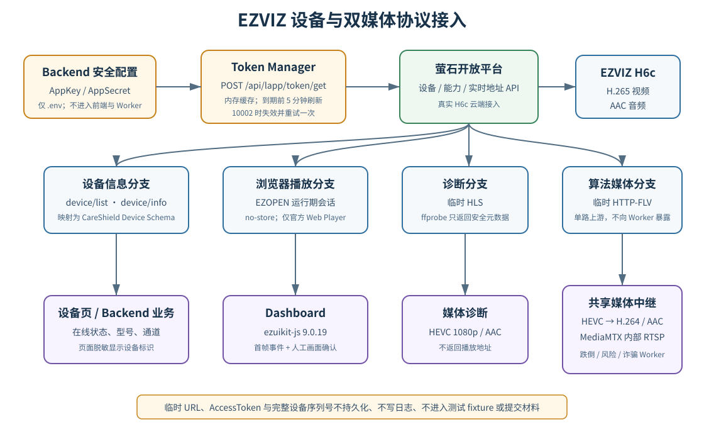

```{=openxml}
<w:p><w:r><w:br w:type="page"/></w:r></w:p>
```

# 目录

1. 材料说明与证据口径
2. 接入对象与调用架构
3. 开放平台接口调用实现
4. 真实设备与媒体调用证据
5. 业务系统应用证据
6. 安全与隐私控制证据
7. 自动化测试与复核方法
8. 结论、限制与提交清单
9. 代码证据索引
10. 官方接口依据

# 1 材料说明与证据口径

本文档对应初审材料“08_萤石开放平台调用证据”，用于证明智安护居（CareShield）V1.0 已通过萤石开放平台接入真实 EZVIZ H6c，并将设备查询、浏览器实时预览、服务端媒体获取、设备能力查询和临时语音播报实验纳入可审查的软件边界。材料基线为 Git 标签 `v1.0.0`、提交 `e8e474c`，证据日期截至 2026 年 9 月 4 日。

本文只记录可由代码、自动化测试、脱敏 API 结果、媒体元数据或人工画面确认复核的事实。AppKey、AppSecret、AccessToken、完整设备序列号和临时播放地址属于敏感信息，不作为“调用成功截图”公开。本文以脱敏字段、响应状态、设备型号和媒体元数据证明调用结果，不展示秘密值。

本轮文档整理时 `localhost:8000` 未运行，未重新发起真实云端请求。第 4 章的运行数据来自项目在 2026 年 9 月 4 日归档的测试报告；第 7 章的自动化测试于同日按本文命令重新执行。二者分别标记，避免把历史运行记录写成本轮在线实测。

| 项目 | 内容 |
|---|---|
| 系统与版本 | CareShield V1.0.0 |
| 代码基线 | `v1.0.0` / `e8e474c` |
| 接入平台 | 萤石开放平台（EZVIZ Open API） |
| 真实设备 | EZVIZ CS-H6c-V200-8H8WFL，完整序列号不记录 |
| Backend | FastAPI + HTTPX，第三方调用位于 EZVIZ Adapter |
| 浏览器播放器 | 官方 `ezuikit-js` 9.0.19，EZOPEN 协议 |
| 服务端媒体 | 临时 HLS 用于诊断；临时 HTTP-FLV 用于共享媒体中继 |
| 证据类型 | 代码、测试、脱敏 API、ffprobe 元数据、人工画面确认 |

## 1.1 证据分级

| 等级 | 判定依据 | 本材料中的用途 |
|---|---|---|
| A：真实运行证据 | 真实账号、真实设备、脱敏响应或人工现场确认 | 设备在线、真实画面、音视频元数据、语音接口返回码 |
| B：实现证据 | 可定位的生产代码、配置和数据契约 | 接口路径、参数、分层、安全控制 |
| C：自动化测试证据 | Mock Transport 或服务级测试，可重复执行 | Token 刷新、错误映射、协议参数和敏感字段控制 |
| 待复核 | 当前没有实时端点或完整统计记录 | 答辩前截图、长期稳定性、物理扬声器出声 |

单元测试证明请求构造和边界逻辑符合设计，但不证明当前账号或摄像机在线；真实 API 状态证明指定时刻可达，但不替代自动化回归。浏览器收到首帧也不能单独证明画面来自摄像机，必须同时由现场人员观察镜头前动作与页面变化。

# 2 接入对象与调用架构

## 2.1 分层边界

CareShield 按“API Route → Service → EZVIZ Adapter / Token Manager → 萤石开放平台”调用。FastAPI Route 只处理参数、响应模型和安全错误码；Service 判断设备在线状态并映射 CareShield 业务合同；Adapter 使用 `application/x-www-form-urlencoded` 向官方接口发起请求。AI 推理不进入 Backend，算法 Worker 不持有萤石 AppKey、AppSecret、AccessToken或上游临时地址。

{width=16cm}

图1 EZVIZ 设备与双媒体协议接入架构

## 2.2 双媒体协议设计

浏览器和服务端算法面对不同运行环境，因此从同一 H6c 建立两条受控媒体路径：

| 消费方 | 协议与入口 | 选择原因 | 敏感信息控制 |
|---|---|---|---|
| Dashboard 浏览器 | EZOPEN + 官方 Web Player | 面向监控场景的浏览器实时预览 | 运行期会话、`no-store`，前端不持久化 Token |
| Backend 诊断 | 临时 HLS + ffprobe | 获取 codec、分辨率、FPS 和音频字段 | 对外只返回安全元数据，不返回地址 |
| 服务端算法 | 临时 HTTP-FLV → media-relay → 内部 RTSP | Linux 可持续解码，并供多个 Worker 共享 | 只有 Backend/relay 接触临时上游，Worker 无 Secret |

HLS 请求显式指定 `protocol=2`、`type=1`、`quality=1`、`supportH265=1`、`containerFormat=0`、`mute=0`；HTTP-FLV 请求指定 `protocol=4`、`type=1`、`quality=1`、`supportH265=1`、`mute=0`，不发送仅用于 HLS 的 `containerFormat`。临时地址默认申请 3600 秒有效期，且不持久化。

# 3 开放平台接口调用实现

## 3.1 接口与代码映射

| 开放平台能力 | 官方路径 | CareShield 入口或调用方 | 生产代码位置 | 状态 |
|---|---|---|---|---|
| 获取 AccessToken | `POST /api/lapp/token/get` | Backend Token Manager | `backend/app/adapters/ezviz/token_manager.py` | 已实现并由真实设备链使用 |
| 分页查询设备 | `POST /api/lapp/device/list` | `GET /api/devices`、集成状态 | `backend/app/adapters/ezviz/client.py` | 已实现、真实 H6c 已返回 |
| 查询设备详情 | `POST /api/lapp/device/info` | `GET /api/devices/{serial}` | `client.py`、`device_service.py` | 已实现 |
| 查询设备能力 | `POST /api/lapp/device/capacity` | 内部语音服务 | `client.py`、`voice_broadcast_service.py` | 已实现、真实能力已查询 |
| 获取实时流地址 | `POST /api/lapp/v2/live/address/get` | HLS 诊断、HTTP-FLV 中继 | `client.py`、`stream.py`、`stream_service.py` | 已实现并验证真实媒体 |
| EZOPEN 播放 | `ezopen://.../{channel}.live` | `GET /api/devices/{serial}/browser-playback` | `stream_service.py`、`DashboardLiveMonitor.vue` | 已实现、人工确认真实画面 |
| 临时语音下发 | `POST /api/lapp/voice/sendonce` | 受内部 Bearer 保护的临时音频接口 | `client.py`、`internal_media.py` | 请求到达云端；因额度返回 `111000` |

## 3.2 AccessToken 获取、缓存与刷新

Token Manager 从 Backend 环境读取 AppKey 与 AppSecret，以表单方式调用 `/api/lapp/token/get`，只接受业务码 `200` 且校验 `data.accessToken` 和 `data.expireTime`。Token 仅保存在进程内存，不写数据库或日志；系统根据毫秒级 `expireTime` 判断有效性，并在到期前 5 分钟刷新。并发刷新由异步锁合并，避免同一进程同时重复申请。

调用设备、能力或实时地址接口时，Adapter 将当前 AccessToken 注入表单。若上游返回 Token 失效码 `10002`，系统立即清空缓存、强制申请新 Token，并只重试原请求一次。对浏览器的唯一例外是官方 EZOPEN Web SDK 需要运行期 Token：专用会话接口只在显式启用时返回，并强制禁止缓存。

## 3.3 设备查询与标准化

设备列表按每页 50 条分页读取，达到上游 `total` 或最后一页后停止。萤石原始 JSON 不直接透传给页面；`DeviceService` 将设备序列号转换为稳定哈希 ID，将 `status=1/0` 映射为 `online/offline`，并仅输出 CareShield 定义的型号、名称、通道和更新时间等字段。设备页进一步对设备标识脱敏显示。

这种映射使前端不依赖供应商字段细节，也避免将完整上游响应作为日志、fixture 或申报附件保存。

## 3.4 实时地址调用

`EzvizClient.get_live_address()` 统一调用 `/api/lapp/v2/live/address/get`。`EzvizStreamAdapter` 根据消费场景选择 HLS 或 HTTP-FLV，并将上游响应缩减为临时 `playback_url`、平台流 ID 和过期时间。`StreamService` 在请求地址前先查询设备，设备明确离线时直接返回 503，不继续占用播放会话。

浏览器会话不把 AppSecret 交给前端。Backend 根据已授权设备和官方 EZOPEN 域生成运行期播放地址，同时返回播放器必需的 AccessToken；路由写入：

```text
Cache-Control: no-store, private
Pragma: no-cache
```

刷新或重连时，Vue 组件销毁旧播放器并重新申请会话。Token 和 EZOPEN URL 不写入 localStorage、数据库或测试 fixture。

## 3.5 设备能力与临时语音下发

语音实验先调用 `/api/lapp/device/capacity` 检查通道能力，再由 Backend 以内存中的 multipart 数据调用 `/api/lapp/voice/sendonce`。音频不落盘、不写 Redis、不进入日志；内部入口要求 `AI_WORKER_SHARED_TOKEN`。当前诈骗告警语音功能默认关闭，只有云广播资源包、设备能力和运维音频均满足要求后才允许启用。

# 4 真实设备与媒体调用证据

## 4.1 2026 年 9 月 4 日归档 API 状态

项目测试报告在固定基线 `v1.0.0` / `e8e474c` 上记录了以下脱敏运行结果：

| CareShield 检查入口 | 归档结果 | 能证明的事实 | 不能外推的结论 |
|---|---|---|---|
| `GET /api/integrations/ezviz/status` | `configured=true`、`reachable=true` | Backend 已配置，且当时能通过真实 Open API 完成可达性检查 | 不代表任意后续时刻均在线 |
| `GET /api/devices` | 返回 1 台 EZVIZ H6c，`online=true` | 真实账号下设备列表调用成功，设备当时在线 | 不披露完整序列号，不证明视频内容 |
| 设备型号字段 | `CS-H6c-V200-8H8WFL` | 返回设备与项目目标硬件一致 | 不代替序列号核验 |
| 设备页面 | 型号、Online、脱敏标识 | 前端消费的是 Backend 标准化结果 | 页面截图需与控制台现场交叉核对 |

建议正式附件中的接口截图只保留请求路径、HTTP 状态、`configured/reachable`、型号和 `online` 字段；对完整序列号、Token、Cookie、请求头及播放地址打不可逆遮挡。

## 4.2 真实浏览器画面证据

既有人工验收已确认 Dashboard 通过官方 `ezuikit-js` EZOPEN Player 显示真实 H6c 视频和声音，并在摄像机前移动物体，观察到页面画面同步变化。页面只有在 SDK 首帧事件后显示 `LIVE`。

本项目曾发现萤石错误提示也可能是一段可解码视频，因此真实性判据不是单纯的 HTTP 200、播放器 started 或时间推进，而是同时满足：播放器收到首帧；页面不是平台错误提示媒体；镜头前现场动作能在页面中对应出现。当前没有统一时钟和重复试验形成端到端延迟分位数，材料不填写“低于某秒”的精确结论。

## 4.3 HLS 媒体诊断证据

对真实 H6c 临时 HLS 会话进行安全 ffprobe，归档结果如下：

| 媒体 | 字段 | 实测值 |
|---|---|---|
| Video | codec / profile | HEVC / H.265 Main |
| Video | resolution | 1920 × 1080 |
| Video | frame rate | 约 15 FPS |
| Video | pixel format | yuv420p |
| Audio | codec | AAC LC |
| Audio | sample rate | 16000 Hz |
| Audio | channels | 1，mono |
| Video / Audio | bitrate | 本次 manifest / ffprobe 未取得 |

上述元数据证明临时地址包含可解码的视频和音频轨。ffprobe 成功本身不能证明内容一定来自目标摄像机，因此仍与第 4.2 节的人工画面证据组合使用。探测脚本只输出媒体元数据，临时地址和凭据不进入标准输出。

## 4.4 HTTP-FLV 与共享算法媒体证据

算法侧通过同一实时地址接口申请 `protocol=4` 的 HTTP-FLV。media-relay 使用 PyAV/FFmpeg 解码 H6c 的 HEVC/AAC，再以低延迟 H.264/AAC 发布为内部 RTSP；实时跌倒 Worker、诈骗 Worker和批处理采集共同消费该内部源，避免各 Worker 重复向萤石占用会话。

2026 年 9 月 4 日归档运行状态中，media-relay、media-server、实时跌倒 Worker 和诈骗 Worker 均在线；实时跌倒 runtime 为 `stream_status=connected`，诈骗 runtime 为 `audio_status=connected`。这证明真实媒体已进入服务端算法链。归档同时记录累计重连次数偏高，因此不能宣称已经完成 2 小时稳定性、可用率或丢帧率验证。

## 4.5 设备能力与语音调用证据

2026 年 9 月 2 日对同一型号真实设备完成能力查询，返回 `support_talk=1`、`support_alarm_voice=1`。随后使用本机临时生成、约 3.8 秒的 WAV 调用 `/api/lapp/voice/sendonce`，萤石返回业务码 `111000`。

该返回证明设备能力查询成功，临时音频请求已到达萤石云广播服务；根据项目采用的官方错误定义，`111000` 表示当前账号云广播资源包余量不足。因此“API 调用链已验证”，但“摄像机扬声器已实际出声”未通过，不能将其写成完整语音播报告警能力。当前配置保持 `FRAUD_VOICE_ALERT_ENABLED=false`，未为撰写材料继续产生收费调用。

# 5 业务系统应用证据

## 5.1 设备管理页面

`/devices` 调用 CareShield 的集成状态、设备列表和设备详情接口，显示平台、型号、在线状态、摄像头通道和脱敏设备标识。页面不直接请求萤石域名，不解析萤石原始 JSON，也不持有 AppKey/AppSecret。该页面可与萤石控制台中的同一设备型号和在线状态进行现场交叉验证。

## 5.2 Dashboard 实时预览

`DashboardLiveMonitor.vue` 选择真实在线设备，向 Backend 申请禁止缓存的 EZOPEN 会话，再创建官方播放器。播放器使用本地构建阶段复制的官方解码静态资源；首帧、错误、销毁和重连由组件生命周期管理。页面不把 AccessToken 写入持久化浏览器存储。

## 5.3 AI 与风险业务

Backend/relay 获取的一路临时 HTTP-FLV 被转换为内部 RTSP，实时跌倒检测从视频帧提取人物和姿态，诈骗 Worker 从 AAC 音轨进行本地 ASR，跌倒风险任务按受控时间窗采集视频。算法输出通过统一结果合同返回 Backend，萤石 Secret 和临时上游地址不进入算法结果、Redis 或 WebSocket。

本节证明萤石媒体已被项目功能消费，不证明跌倒或诈骗算法的医学有效性、准确率或误报率；算法统计结论以独立测试报告为准。

# 6 安全与隐私控制证据

| 风险 | 项目控制 | 可核查位置 |
|---|---|---|
| AppSecret 泄露 | 仅从被 Git 忽略的 `.env` 读取；示例文件只有占位符 | `.gitignore`、`.env.example`、`backend/app/core/config.py` |
| Token 长期保存 | Token Manager 仅在进程内缓存并按过期时间刷新 | `backend/app/adapters/ezviz/token_manager.py` |
| 浏览器缓存播放凭据 | 专用会话显式启用，响应设置 `no-store, private` 和 `no-cache` | `backend/app/api/streams.py` |
| 前端持有 Secret | 前端只调 CareShield API；任何接口都不返回 AppSecret | `frontend/src/api/`、Backend response schema |
| Worker 获得供应商凭据 | Worker 使用内部 Bearer 调 Backend/relay，不配置 EZVIZ Secret | `docker-compose.yml`、`backend/app/api/internal_media.py` |
| 临时地址进入日志/附件 | 不记录完整 URL；媒体诊断只输出元数据 | `scripts/probe_ezviz_stream.py`、项目文档约束 |
| 原始家庭音频保存 | 实时诈骗链不保存原始音频或完整对话 | `fraud-worker/`、内部语音接口 |
| 上游错误泄露 | 对外只返回安全摘要和必要业务码，不透传完整响应 | `backend/app/api/devices.py`、`streams.py` |
| 完整设备身份公开 | 服务端产生稳定哈希 ID，页面和材料脱敏 | `backend/app/services/device_service.py` |

仓库根目录 `.gitignore` 排除 `.env` 与 `.env.*`，仅放行 `.env.example`。示例配置使用 `your_app_key`、`your_app_secret`，浏览器播放默认关闭。正式部署者必须在合法授权的本机环境配置真实值，不能把凭据作为命令参数、测试 fixture、日志或截图内容提交。

# 7 自动化测试与复核方法

## 7.1 本次可重复测试结果

2026 年 9 月 4 日在仓库根目录执行：

```bash
PYTHONPATH=shared/python .venv/bin/python -m pytest \
  backend/tests/test_ezviz_token_manager.py \
  backend/tests/test_device_service.py \
  backend/tests/test_device_api.py \
  backend/tests/test_stream_service.py \
  backend/tests/test_stream_api.py \
  backend/tests/test_media_probe_service.py \
  backend/tests/test_internal_media_api.py \
  backend/tests/test_internal_voice_api.py \
  backend/tests/test_voice_broadcast_service.py -q
```

结果为 `30 passed in 0.22s`。测试使用 HTTPX Mock Transport 或服务替身，不访问真实萤石账号、不保存真实设备数据，覆盖：

- Token 解析、进程内缓存、过期刷新和 `10002` 单次重试；
- 设备列表/详情标准化、未配置状态和安全 HTTP 错误；
- HLS 的 H.265/TS/音频参数与 HTTP-FLV 的 `protocol=4` 参数；
- 离线设备不继续申请流、上游错误安全映射；
- EZOPEN 会话必须显式启用且响应禁止缓存；
- 内部媒体接口需要 Worker Bearer，且不返回萤石 Secret；
- 媒体元数据映射及“可解码错误提示不等于真实摄像画面”；
- 设备能力、临时语音、音频大小/格式限制与 `111000` 安全映射。

## 7.2 答辩前现场复核步骤

1. 固定 Git 标签和测试时间，启动 Compose；先确认 Backend、Redis、media-relay 和相关 Worker 状态，不通过刷新页面掩盖错误。
2. 调用 `/api/integrations/ezviz/status`，确认 `configured=true`、`reachable=true`；截图前隐藏浏览器网络面板中的请求头和敏感响应。
3. 打开 `/devices`，将 CareShield 的设备型号、Online 状态与萤石控制台交叉核对；完整序列号两侧都遮挡。
4. 打开 `/dashboard`，等待首帧后在镜头前移动经授权的普通物体，录制“现场动作—页面变化”同框证据；不要拍摄老人隐私活动。
5. 执行 `python3 scripts/probe_ezviz_stream.py`，保存只含 codec、分辨率、FPS 和音频字段的输出；检查终端中没有完整 URL 或 Token。
6. 检查 media-relay、实时跌倒和诈骗 Worker 的安全状态摘要，确认视频与音频为 connected；不要复制包含临时地址的调试日志。
7. 如账号尚无云广播资源包，不重复执行语音调用；只保留既有 `111000` 证据并标注“未出声”。购买资源后方可按授权流程补做物理验收。

## 7.3 建议截图编号

| 编号 | 截图内容 | 必须保留 | 必须遮挡 |
|---|---|---|---|
| EZ-01 | 萤石集成状态 API | 路径、时间、configured/reachable | Cookie、Authorization、Token |
| EZ-02 | CareShield 设备页与萤石控制台对照 | 型号、Online | 完整序列号、账号信息 |
| EZ-03 | Dashboard 真实画面同框验证 | 页面状态、现场动作对应 | 家庭隐私区域、设备身份 |
| EZ-04 | 安全媒体探测 | HEVC、1080p、约15 FPS、AAC 16 kHz mono | 完整 HLS/FLV 地址 |
| EZ-05 | 服务端媒体链状态 | relay 与视频/音频 connected | 内部 Token、上游 URL |
| EZ-06 | 语音实验记录 | 能力字段、错误码 `111000`、日期 | 上传音频内容、凭据、序列号 |

# 8 结论、限制与提交清单

## 8.1 证据结论

现有证据形成了“真实账号认证 → 真实 H6c 设备查询 → EZOPEN 浏览器播放 / HLS 媒体诊断 / HTTP-FLV 算法媒体 → CareShield 页面与 Worker 消费”的完整调用链。设备在 2026 年 9 月 4 日归档状态中为 Online；真实 HLS 会话检出 HEVC 1920×1080、约 15 FPS 和 AAC LC 16 kHz 单声道；人工验收确认 EZOPEN 页面显示真实画面和声音；服务端视频与音频消费者处于 connected。设备能力和临时语音 API 也已真实到达萤石平台，但受云广播资源额度限制，尚未完成扬声器出声。

上述结论足以证明 CareShield 不是使用静态 Mock 设备或假媒体伪装萤石接入。Mock 仅用于不接触真实凭据的自动化回归，正式运行证据来自真实设备和脱敏调用结果。

## 8.2 明确限制

- 本轮撰写时 Backend 未启动，未把历史状态误写成当次在线调用；正式提交前应按第 7.2 节刷新时间戳和截图。
- 没有统一时钟、重复试验和分位数统计，不能给出精确 EZOPEN 或告警端到端延迟。
- 当前归档重连次数偏高，尚未完成 2 小时连续稳定性、可用率和丢帧率测试。
- `111000` 表明语音请求到达云广播服务但额度不足，不能宣称 H6c 已实际播音。
- 设备在线、媒体可解码和算法可运行不等于跌倒检测、风险评估或诈骗识别具有临床验证准确率。

## 8.3 正式提交包检查

正式材料建议由本文档、EZ-01 至 EZ-05 的脱敏截图/录屏、固定 Git hash 的测试输出和必要的官方接口链接组成。EZ-06 可作为“受资源额度限制的真实调用记录”附上，但标题必须包含“未完成物理出声”。提交前执行 Secret 扫描并人工复核所有图片，不得以可复制的黑色文本框覆盖敏感值；应裁剪或栅格化后确认原值不可恢复。

# 9 代码证据索引

| 证据主题 | 文件 |
|---|---|
| 环境配置与默认关闭 | `.env.example`、`.gitignore`、`backend/app/core/config.py` |
| Token 获取、缓存与刷新 | `backend/app/adapters/ezviz/token_manager.py` |
| 设备、能力、实时地址与语音调用 | `backend/app/adapters/ezviz/client.py` |
| HLS / HTTP-FLV 参数分流 | `backend/app/adapters/ezviz/stream.py` |
| 设备标准化与稳定哈希 ID | `backend/app/services/device_service.py` |
| 设备在线检查与播放会话 | `backend/app/services/stream_service.py` |
| 禁止缓存响应与安全错误 | `backend/app/api/streams.py`、`backend/app/api/devices.py` |
| Worker 内部媒体边界 | `backend/app/api/internal_media.py` |
| 官方播放器集成 | `frontend/src/components/DashboardLiveMonitor.vue` |
| 安全媒体探测脚本 | `scripts/probe_ezviz_stream.py` |
| 共享媒体中继 | `media-relay/`、`docs/media-relay.md` |
| 设备与流测试 | `backend/tests/test_ezviz_token_manager.py`、`test_stream_service.py` 等 |
| 真实语音实验记录 | `docs/ezviz-voice-broadcast.md` |

# 10 官方接口依据

1. 萤石开放平台：《获取 AccessToken》，<https://open.ys7.com/help/81>。
2. 萤石开放平台：《分页查询设备列表》，<https://open.ys7.com/help/673>。
3. 萤石开放平台：《获取单个设备信息》，<https://open.ys7.com/help/672>。
4. 萤石开放平台：《获取设备能力集》，<https://open.ys7.com/help/678>。
5. 萤石开放平台：《获取设备实时流地址》，<https://open.ys7.com/help/1414>。
6. 萤石开放平台：《EZOPEN 协议说明》，<https://open.ys7.com/help/1751>。
7. 萤石开放平台：《视频直播协议对比》，<https://open.ys7.com/help/2821>。
8. 萤石开放平台：《EZUIKit Web 接入》，<https://open.ys7.com/help/4294>。
9. 萤石开放平台：《临时语音下发接口》，<https://open.ys7.com/help/1252>。
10. 萤石开放平台：《云广播操作指南》，<https://open.ys7.com/help/5116>。
